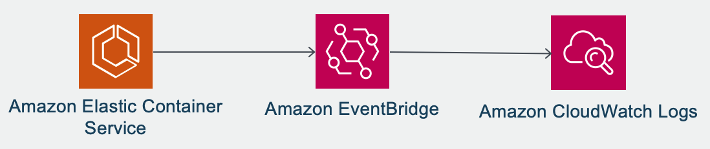

# ECS Stopped Tasks in CloudWatch Logs

## Context

Amazon ECS stopped tasks are returned for at least 1 hour as described in the ListTasks API reference.

> Recently stopped tasks might appear in the returned results. Currently, stopped tasks appear in the returned results for at least one hour.

https://docs.aws.amazon.com/AmazonECS/latest/APIReference/API_ListTasks.html

It also applies for the DescribeTasks API.

It means that if you want to investigate a task that was stopped more than 1 hour, you won't be able to retrieve the information. For RCA purposes information such as: time when the task was stopped, stopped reason of the task and the exit code of the containers it's crucial.

## Solution

The solution stores in CloudWatch Logs the EventBridge event that is triggered when a task is stopped.



To investigate and analyze the logs we recommend to use CloudWatch Logs Insights.

The solution can be deployed using [this](ecs-stopped-tasks-cwlogs.yaml) CloudFormation template.

#### Amazon EventBridge Event Pattern

Amazon ECS sends three types of events to EventBridge: container instance state change events, task state change events and service action events. If these resources change an event is triggered.

https://docs.aws.amazon.com/AmazonECS/latest/developerguide/ecs_cwe_events.html

The following CloudWatch event pattern will match only the events when a task is stopped.

```
{
  "detail-type": [
    "ECS Task State Change"
  ],
  "source": [
    "aws.ecs"
  ],
  "detail": {
    "desiredStatus": [
      "STOPPED"
    ],
    "lastStatus": [
      "STOPPED"
    ]
  }
}
```

#### Amazon CloudWatch Logs

An example of the event stored in Amazon CloudWatch Logs can be found [here](cw-event.json).

#### Amazon CloudWatch Logs Insights

With CloudWatch Logs Insights you can easily search and analyze the log data in CloudWatch Logs. The following are sample queries:

- Show a stopped task given a task ID.

`filter detail.taskArn like "<Task_ID>"`

- Show stopped tasks for a given cluster and service name.

`filter detail.clusterArn like "<Cluster_Name>" and detail.group like "<Service_Name>"`

- Show *stoppedReason* and *exitCode* of a container given a task ID.

`fields detail.stoppedReason, detail.containers.0.name, detail.containers.0.exitCode | filter detail.taskArn like "<Task_ID>"`

#### Deploy the solution with AWS CloudFormation

To automate the deployment of this solution, you can use [this](ecs-stopped-tasks-cwlogs.yaml) CloudFormation template.

## License

This library is licensed under the MIT-0 License. See the LICENSE file.
